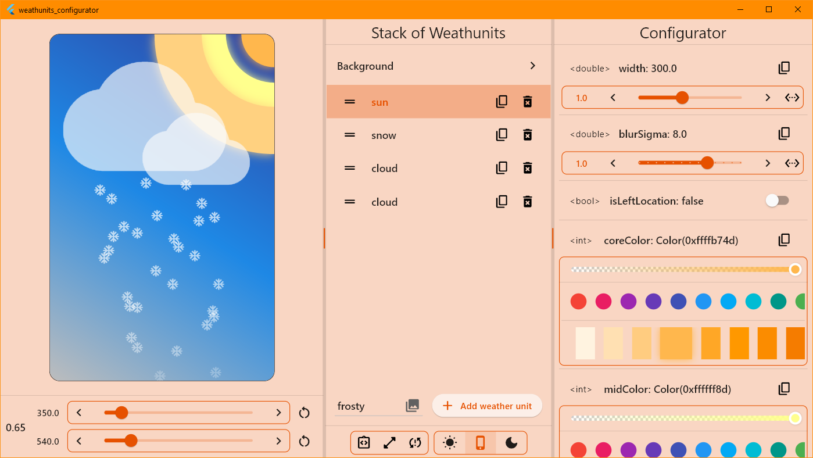

[![telegram_badge]][telegram_link]
[![pub_badge]][pub_link]
[![configurator_badge]][configurator_link]
[![repo_star_badge]][repo_star_link]
[![license_badge]][license_link]
![GitHub code size in bytes][code_size_badge]


## 🌇 weather_animation

Create weather scenes and animate as your heart desires. Simple and free.

Try the [Weathunits configurator][configurator_link] for setting weather scenes directly in the WEB!

## Motivation

- 🎨 colorful weather scenes without using gif/png and stuff source
- 🆓 free license for use in your projects (including commercial ones)
- 🎛 easy creation of scenes and easy customization when needed
- 🌅 configurator for easy creation of weather scenes
- 😅 enjoy yourself and you with another fun package

## Table of Contents

<!-- TOC -->
  * [🌇 weather_animation](#-weather_animation)
  * [Motivation](#motivation)
  * [Table of Contents](#table-of-contents)
  * [How to use simply?](#how-to-use-simply)
    * [Use `WeatherScene`](#use-weatherscene)
    * [Use `WrapperScene`](#use-wrapperscene)
    * [Use `weather_configurator` app](#use-weather_configurator-app)
  * [Library structure](#library-structure)
    * [Configuration files `...Config`](#configuration-files-config)
    * [About `WrapperScene`](#about-wrapperscene)
    * [About `BackgroundWidget`](#about-backgroundwidget)
  * [Additional information](#additional-information)
<!-- TOC -->

## How to use simply?

Import the library:
```dart
import 'package:weather_animation/weather_animation.dart';
```

### Use `WeatherScene`

Check the provided list of ready-made weather scenes in the `WeatherScene` enumeration and select 
the desired one:
```dart
@override
Widget build(BuildContext context) {
  return WeatherScene.sunset.getWeather();
}
```

### Use `WrapperScene`

Specify a list of weather widgets and a list of colors to create a beautiful background gradient:
```dart
@override
Widget build(BuildContext context) {
  return const WrapperScene(
      colors: [
        Color(0xff283593),
        Color(0xffff8a65),
      ],
      children: [
        SunWidget(),
        CloudWidget(),
        WindWidget(),
      ],
    );
}
```

If necessary, specify a configuration file to fine-tune the weather widget:
```dart
...
SunWidget(
  sunConfig: SunConfig(
    width: 262.0,
    blurSigma: 10.0,
    blurStyle: BlurStyle.solid,
    isLeftLocation: true,
    coreColor: Color(0xffffa726),
    midColor: Color(0xd6ffee58),
    outColor: Color(0xffff9800),
    animMidMill: 2000,
    animOutMill: 1800,
  ),
),
...
```

### Use `weather_configurator` app

- online in web --> [Weathunits configurator][configurator_link]
- offline after build project on your gadget (path `example/weathunits_configurator`. Learn more [here](https://github.com/PackRuble/weather_animation/tree/master/example/weathunits_configurator/))



## Library structure

The only point of using the library is to import the following file:
```dart
import 'package:weather_animation/weather_animation.dart';
```

The following weather widgets are available:

| Widget weather                             | A configuration class |
|--------------------------------------------|-----------------------|
| `CloudWidget`                              | `CloudConfig`         |
| `RainWidget`<br/>`RainDropWidget`*         | `RainConfig`          |
| `SnowWidget`<br/>`SnowflakeWidget`*        | `SnowConfig`          |
| `SunWidget`                                | `SunConfig`           |
| `ThunderWidget`<br/>`SingleThunderWidget`* | `ThunderConfig`       |
| `WindWidget`                               | `WindConfig`          |

💡**Tip**: Widgets under `*` represent a single weather item. Use these when another `Stack` setting is required.

Each weather widget accepts an optional configuration parameter to fine-tune the widget.

### Configuration files `...Config`

- have correctly `toString`, `operator ==`, `hashCode`
- have a `copyWith` method to clone the object
- have de/serialization handling (`toJson` and `fromJson`). Note: not all fields
- are inherited from class `WeatherConfig`

### About `WrapperScene`

Also, there is a `WrapperScene` widget for quick scene adjustment, which allows you to scale the 
weather scene relative to the specified canvas dimensions. Has a clipper and scene widget decoration.

### About `BackgroundWidget`
The `BackgroundWidget` class allows you to create a color background in the form of a linear gradient.
Specify the desired colors and you're done.

## Additional information
Made with ❤️. Enjoy it!


<!-- Links -->
[pub_badge]: https://img.shields.io/pub/v/weather_animation.svg?style=plastic
[license_badge]: https://img.shields.io/github/license/PackRuble/weather_animation?style=plastic
[code_size_badge]: https://img.shields.io/github/languages/code-size/PackRuble/weather_animation?style=plastic
[repo_star_badge]: https://img.shields.io/github/stars/PackRuble/weather_animation?style=plastic

[pub_link]: https://pub.dev/packages/weather_animation
[license_link]: https://github.com/PackRuble/weather_animation/blob/master/LICENSE
[repo_star_link]: https://github.com/PackRuble/weather_animation

[telegram_badge]: https://img.shields.io/badge/telegram-❤️-252850?style=plastic&logo=telegram
[telegram_link]: https://t.me/+AkGV73kZi_Q1YTMy

[configurator_badge]: https://img.shields.io/badge/🎄web%E2%80%90app-try-CB6586?style=plastic
[configurator_link]: https://packruble.github.io/weather_animation/

---

<h6>
🏷 tags: weather, animation, weather conditions, weather scenes
</h6>